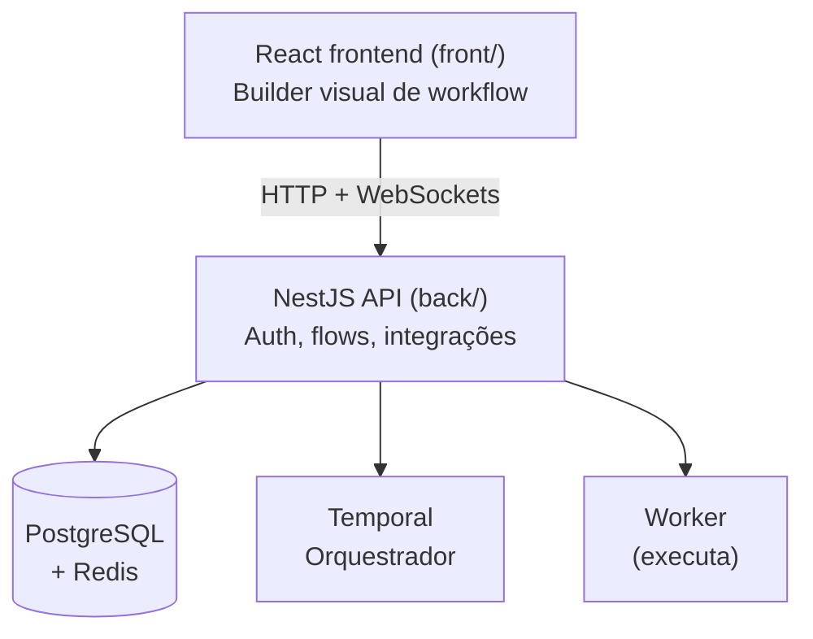

## O que é o FluxPrompt

O FluxPrompt é um sistema operacional de IA que fica entre os times e os modelos de IA que eles usam. Em vez de gerenciar logins separados para OpenAI, Anthropic, Google e mais uma dúzia de outros provedores, o FluxPrompt unifica tudo em uma única plataforma onde os usuários constroem workflows de IA visualmente — conectando mais de 150 modelos, roteando tarefas para o melhor de cada caso, e rodando automações pelos processos do negócio.

O detalhe é que comprar acesso aos modelos é a parte fácil. A parte difícil é: quem na empresa pode usar qual modelo, quanto pode gastar, que dado sai da empresa em um prompt, quem aprova um workflow antes de subir, e como saber o que está realmente rodando entre centenas de automações. **Isso é o que a gente vende.** Governança e visibilidade sobre o uso de IA, com um builder de workflow no-code em cima pra que pessoas não-engenheiras consigam entregar.

Se você quer o mesmo parágrafo em linguagem de marketing, o [site público](https://fluxprompt.ai/) tem. Se quer a versão arquitetural, o [Project overview](/getting-started/overview) (em inglês) vai mais fundo.

## Quem usa a gente

`<TODO: 2-3 customer stories curtas com nomes + casos de uso que o novo membro reconheceria da imprensa ou LinkedIn. A ideia é fazer ele sentir "ah, a gente trabalha com empresas reais fazendo coisas reais". Exemplos pra brainstorm: um time de marketing rodando workflows de conteúdo, um time de suporte rodando triagem de tickets, um time financeiro rodando extração de notas. Use nomes anonimizados se precisar, mas mantenha as verticais concretas.>`

<Tip>
  O maior multiplicador da qualidade do seu trabalho aqui é **empatia com o cliente**. Pegue uma dessas histórias e leia todos os flows que ele tem no workspace dele antes de mexer em código relacionado. Duas horas de contexto poupam duas semanas de "espera, por que isso não funciona pro caso dele?"
</Tip>

## Por que isso importa

Três coisas reais, não slogans:

1. **O gasto com IA está explodindo e a accountability não.** Empresas não sabem qual modelo está sendo chamado, por quem, com qual dado. A gente torna isso visível no nível da organização. Quando um time usa 3× o orçamento dele em Claude Opus no mês, ele é notificado — não acusado.
2. **Builders de workflow no-code multiplicam impacto.** Times de marketing, ops e suporte entregam automações de IA sem esperar a engenharia. Nosso trabalho do lado da engenharia é tornar isso rápido, seguro e debugável.
3. **Modelos mudam o tempo todo.** Nossos clientes não deveriam ter que migrar a cada novo Claude ou GPT. A camada de orquestração absorve o churn.

## Ambientes

| Ambiente | URL | Quem usa |
| --- | --- | --- |
| Produção | [app.fluxprompt.ai](https://app.fluxprompt.ai/) | Clientes reais. Trate com respeito. |
| Staging | [staging.fluxprompt.ai](https://staging.fluxprompt.ai/) | Testes pré-produção antes de uma mudança visível pro cliente |
| Dev | [dev.fluxprompt.ai](https://dev.fluxprompt.ai/) | Onde a gente quebra as coisas de propósito |

Quando alguém diz "está no ar" ou "está em prod" — é a primeira URL. Quando você ouvir "deixa eu checar em staging antes" — é a segunda. Dev é pra experimentos e demos que ainda não estão prontas nem pra um semi-público.

## O sistema, em 30 segundos

O usuário desenha um workflow na UI React. O frontend bate na API NestJS, que persiste no Postgres. Quando o workflow roda, o Temporal agenda cada node, o Worker executa (chamando os modelos de IA ou APIs necessárias), e os resultados voltam streamando pro usuário.

Pra mais profundidade (em inglês): [Project overview](/getting-started/overview), [Main API](/main-api/overview), [Worker](/worker/overview), [Client](/client/overview).

## Próximo

Você sabe o que a gente está construindo. Agora veja [sua primeira semana](/getting-started/welcome/pt-br/first-week) — até sexta você terá entregue uma parte real disso.
