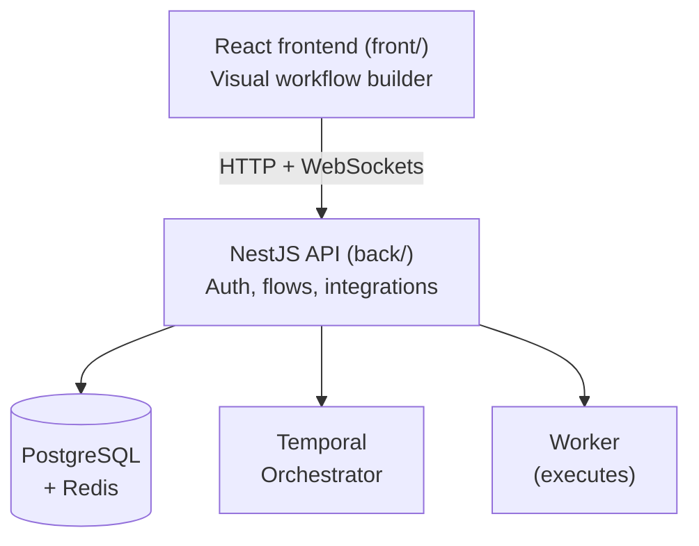

## What is FluxPrompt

FluxPrompt is an AI operating system that sits between teams and the AI models they use. Instead of juggling logins to OpenAI, Anthropic, Google, and a dozen other vendors, FluxPrompt unifies them into one platform where users build AI workflows visually — connecting 150+ models, routing tasks to the best one, and running automations across their business processes.

The catch is that buying access to AI models is the easy part. The hard parts are: who in the company is allowed to use which model, how much they can spend, what data leaves the company in a prompt, who approves a workflow before it goes live, and how to know what's actually running across hundreds of automations. **That's what we sell.** Governance and visibility over AI use, with a no-code workflow builder on top so non-engineers can ship.

If you want the same paragraph in marketing-speak, the [public site](https://fluxprompt.ai/) has it. If you want the architectural one, [Project overview](/getting-started/overview) goes deeper.

## Who uses us

`<TODO: 2–3 short customer stories with names + use cases the new hire would recognize from the news or LinkedIn. The point is to make them feel "oh, we work with real companies doing real stuff". Examples to brainstorm: a marketing team running content workflows, a customer-support team running ticket triage, a finance team running invoice extraction. Use anonymized names if needed but keep the verticals concrete.>`

<Tip>
  The single biggest force multiplier on the quality of your work here is **customer empathy**. Take one of these stories and read every flow they have in their workspace before you touch related code. Two hours of context save two weeks of "wait, why doesn't this work for their case?"
</Tip>

## Why this matters

Three real things, not slogans:

1. **AI spend is exploding and accountability isn't.** Companies don't know what model is being called by whom, with what data. We make that visible at the org level. When a team uses 3× their budget on Claude Opus this month, they get notified — not blamed.
2. **No-code workflow builders multiply impact.** Marketing, ops, and support teams ship AI automations without waiting for engineering. Our job on the engineering side is to make that fast, safe, and debuggable.
3. **Models change constantly.** Our customers shouldn't have to migrate when a new Claude or GPT ships. The orchestration layer absorbs the churn.

## Environments

| Environment | URL | Who uses it |
| --- | --- | --- |
| Production | [app.fluxprompt.ai](https://app.fluxprompt.ai/) | Real customers. Treat with respect. |
| Staging | [staging.fluxprompt.ai](https://staging.fluxprompt.ai/) | Pre-prod testing before a customer-visible change |
| Development | [dev.fluxprompt.ai](https://dev.fluxprompt.ai/) | Where we break things on purpose |

When something is "live" or "in prod" — that's the first URL. When you hear "let me check staging first" — that's the second one. Dev is for experiments and demos that aren't ready to be even semi-public.

## The system, in 30 seconds

A user draws a workflow in the React UI. The frontend hits the NestJS API which stores it in Postgres. When the workflow runs, Temporal schedules each node, the Worker executes it (calling whatever AI models or APIs are needed), and results stream back to the user.

For depth: [Project overview](/getting-started/overview), [Main API](/main-api/overview), [Worker](/worker/overview), [Client](/client/overview).

## Next

You know what we're building. Now see [your first week](/getting-started/welcome/first-week) — by Friday you'll have shipped a real piece of it.
