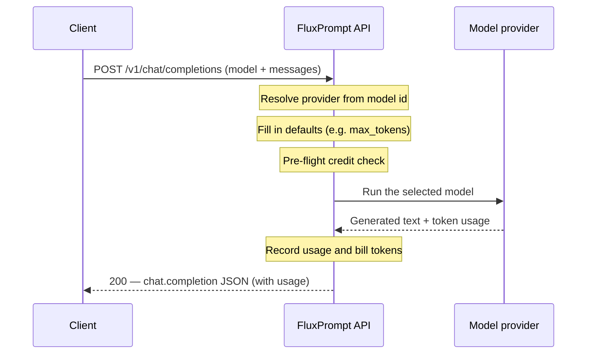
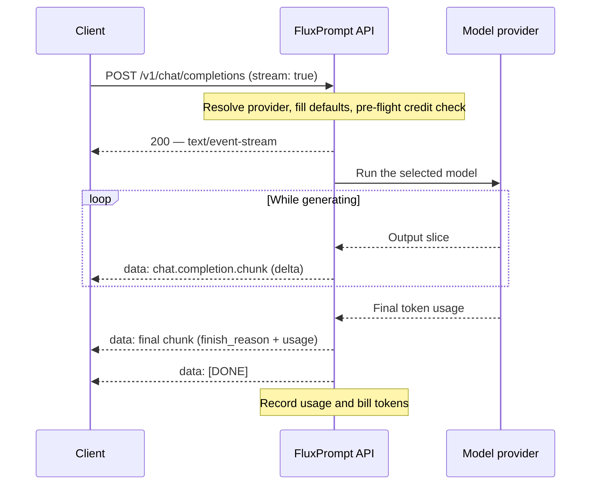

The Completions API takes a minimal, OpenAI-compatible payload and turns it into a finished response. You send a `model` and a few fields; FluxPrompt resolves the provider, fills in the defaults the model needs, runs it, and returns the result. This page explains what happens between your request and the response, and how each request is billed.

## How a request flows

You send a request with a `model` id and a few fields (such as `messages` and an optional `max_tokens`). FluxPrompt resolves the right provider from the model id, fills in any missing parameters from the model's metadata, routes the request to the selected model provider, and returns an OpenAI-shaped response. When you set `stream: true`, the same path streams the output back to you as it is generated.

### Non-streaming

With `stream: false` (the default), you get a single JSON response once the model finishes.

### Streaming

With `stream: true`, the response is returned as server-sent events: a series of `chat.completion.chunk` events, a final chunk carrying `usage`, then a literal `data: [DONE]` line.

<Note>
The same pre-flight checks (provider resolution, model gating, and the credit check) run before any streaming starts. If one fails, you get a clean JSON error instead of a half-open stream.
</Note>

## Billing

Requests are billed in tokens (flux). Each request is metered in two parts — **input** tokens (your prompt) and **output** tokens (the model's response) — and priced according to the model you call.

### What gets billed

<Steps>
  <Step title="Input and output tokens">
    Every request is billed on the tokens it uses, split into input and output. Each model has its own price, so the cost depends on which model you call and how much text goes in and comes out.
  </Step>
  <Step title="Per-request usage">
    The token counts for each request are returned in the `usage` object of the response and recorded against your account, so usage is traceable per request.
  </Step>
  <Step title="Charged after the model runs">
    Tokens are billed once the request completes, using the actual usage reported by the model.
  </Step>
</Steps>

### Pre-flight credit check

Before the model runs, FluxPrompt verifies that your account can pay for the request. If the account has no active subscription or no remaining credits, the request is rejected with `402 insufficient_quota` **before** the model is called.

<Check>
Because the credit check happens before the model runs, you are never charged for a request that did not run.
</Check>

### Streaming is billed the same way

Streaming requests are billed on the same input/output token basis. The charge is applied **after the stream completes**, using the authoritative token usage from the final chunk. There is no double-charge — a streamed request is billed exactly once.

### Traceability

Token usage is recorded per request and tied to your account, so you can reconcile what you were billed against the `usage` returned by each response.

<Info>
The `402 insufficient_quota` error is enforced by the pre-flight credit check. It is the same error documented in the [Chat completions](/main-api/specific-features/completions-api/chat-completions#errors) error table.
</Info>

## Related behavior

A few request behaviors are worth keeping in mind as you read the flow above:

| Behavior | Summary |
| --- | --- |
| Authentication | Every request authenticates with the `api-key` header (user key or company-space key). |
| Provider resolution | The provider (Anthropic, OpenAI, Google Gemini, Groq, Perplexity, or xAI) is derived from the `model` id — you never send a provider name. |
| Deprecated models | `deprecated_model_behavior` controls whether a deprecated model errors or is transparently substituted. |
| OpenAI compatibility | Requests and responses match OpenAI's `/v1/chat/completions`, so OpenAI SDKs work by swapping the base URL. |

## What's next

<CardGroup cols={2}>
  <Card title="Completions API overview" icon="compass" href="/main-api/specific-features/completions-api/overview">
    What the endpoint is, the providers it supports, and how authentication works.
  </Card>
  <Card title="Chat completions" icon="message-square" href="/main-api/specific-features/completions-api/chat-completions">
    Full request parameters, response shape, streaming details, and the error table.
  </Card>
</CardGroup>
