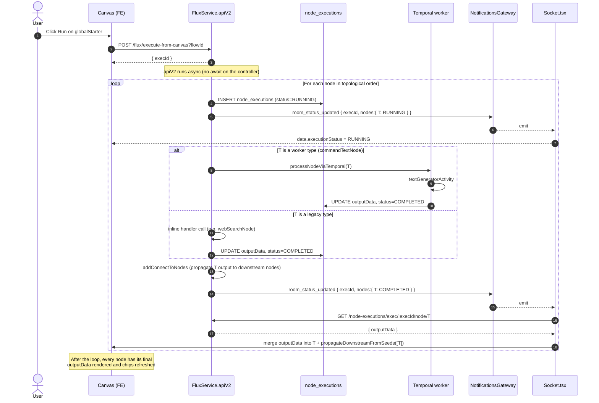

The canvas exposes two ways to trigger execution: pressing **Run** on the global starter runs the whole flow, while pressing **Run** on an individual node runs just that node. Both paths converge on the same persistence contract (`node_executions`) and the same realtime contract (`room_status_updated` over WebSocket), so the frontend treats their outputs uniformly.

## Two execution modes

| Aspect | Global node (full flow) | Single-node Run |
|---|---|---|
| Trigger | Click Run on `FlowGlobalNode` | Click Run on any executable node |
| Endpoint | `POST /flux/execute-from-canvas` | `POST /flux/execute-single-node` |
| Scope | Walks the entire graph from the global starter | Executes exactly one node |
| Engine | `FluxService.apiV2` scheduler | `FluxService.executeSingleNode` dispatcher |
| Worker types | Routed inline through `processNodeViaTemporal` | Started via `client.start('processSingleNode', ...)` |
| Legacy types | Inline handler calls inside the scheduler loop | `dispatchLegacyHandler` calls the same handler methods |
| Returns | `{ execId }` (immediate) | `{ execId }` (immediate) |
| Progress | `room_status_updated` per-node | `room_status_updated` for the single node |
| Output read | `GET /node-executions/exec/:execId/node/:nodeId` | Same endpoint |

Both modes are **fire-and-forget** from the HTTP layer: the controller returns `{ execId }` in under 200 ms and the actual work continues in the background (Temporal worker or in-process `runLegacyAndPersist`).

## Endpoints

### Run the full flow

```http
POST /flux/execute-from-canvas?flowId=<id>&sessionId=<id>&versionId=<id>
Authorization: Bearer <jwt>
Content-Type: application/json

{ /* optional CreateFlowApiDto body */ }
```

Response:

```json
{ "data": { "execId": "a1b2c3..." }, "status": "success" }
```

The controller generates `execId`, then invokes `fluxService.apiV2(...)` without `await`. The scheduler walks the graph from the global starter, executes each node, persists per-node output to `node_executions`, and emits `room_status_updated` for each transition.

### Run a single node

```http
POST /flux/execute-single-node?flowId=<id>&nodeId=<id>&sessionId=<id>&versionId=<id>
Authorization: Bearer <jwt>
```

Response:

```json
{ "data": { "execId": "a1b2c3..." }, "status": "success" }
```

The controller delegates to `fluxService.executeSingleNode(...)`, which generates `execId`, inserts the `RUNNING` row in `node_executions`, then branches into the worker path or the legacy path depending on the node type.

## Execution diagrams

The diagrams below trace the exact same scenario — running a text generator node — through each mode. In both cases the frontend ends up with the new `outputData` merged into the node and downstream chips refreshed; the difference is whether the rest of the graph also runs.

### Full flow via the global node

Triggered when the user clicks Run on the `FlowGlobalNode`. The scheduler walks every reachable node in dependency order; the diagram shows two example nodes (a text generator T followed by an audio generator A) but the loop runs for every node in the flow.



**Key points specific to the global node path:**

- The same `execId` is reused for every node in the run. WebSocket messages always carry it so the frontend can correlate per-node events back to the same execution context.
- Output between connected nodes flows **inside the backend** via `addConnectToNodes` + `modifyData` before the next downstream node starts, so upstream values are already substituted when each node runs.
- The frontend receives `room_status_updated` once per node transition (`RUNNING` then `COMPLETED`), fetches output, and renders incrementally as the run progresses.

### Single text generator Run

Triggered when the user clicks Run on a text generator node specifically. Only that node executes; downstream nodes are not run but their input chips are refreshed.

```mermaid
sequenceDiagram
  autonumber
  actor User
  participant FE as TextGenerator node (FE)
  participant API as FluxService.executeSingleNode
  participant DB as node_executions
  participant TQ as Temporal queue
  participant WK as Temporal worker
  participant WS as NotificationsGateway
  participant Sock as Socket.tsx

  User->>FE: Click Run
  FE->>API: POST /flux/execute-single-node?flowId&nodeId
  API->>DB: INSERT node_executions (status=RUNNING)
  API->>TQ: client.start('processSingleNode',<br/>{ args:[nodeId, userId, sessionId, flowId, versionId, execId, ''] })
  API-->>FE: { execId }
  Note over FE: setNodeState writes data.currentExecId

  TQ->>WK: dispatch workflow
  WK->>WK: textGeneratorActivity<br/>(Anthropic/OpenAI/Gemini/...)
  WK->>DB: persistNodeSuccess<br/>UPDATE outputData, status=COMPLETED<br/>+ merge into flows_nodes.data JSONB
  WK->>WS: notifyStatusActivity<br/>{ execId, nodes:{ T: COMPLETED } }
  WS-->>Sock: room_status_updated

  Sock->>FE: data.executionStatus = COMPLETED
  Note over FE: useEffect clears isLoading
  Sock->>API: GET /node-executions/exec/:execId/node/:nodeId
  API->>DB: SELECT latest by (execId, nodeId)
  API-->>Sock: NodeExecution row (outputData included)
  Sock->>FE: setNodeState updater:<br/>merge outputData into T<br/>+ propagateDownstreamFromSeeds([T])

  Note over FE: T shows new text;<br/>downstream chip arrays (textInputData, etc.)<br/>are recomputed from edges so dependent<br/>nodes display T's new value without re-running
```

**Key points specific to the single-node path:**

- The HTTP response carries `execId` immediately; all subsequent state transitions arrive over WebSocket.
- The worker handles persistence (`persistNodeSuccess`) and notification (`notifyStatusActivity`) — the API does no further work after `client.start`.
- Only the executed node runs. Downstream propagation in the frontend is **preview-only**: it updates the chip arrays so dependent nodes see the new upstream value, but it does not trigger their execution. The user must explicitly click Run on a downstream node to execute it.
- The legacy variant of this path (for node types not yet migrated to the worker) replaces the `Temporal queue → worker` swim lanes with an in-process `runLegacyAndPersist` call. Persistence, WebSocket emission, and frontend handling are otherwise identical.

## Single-node dispatch

`FluxService.executeSingleNode` (in `flux.service.ts`) decides which engine handles the node:

```typescript
if (this.isTemporalNode(targetNode.type)) {
  await this.temporalService.client.start('processSingleNode', {
    args: [nodeId, userId, sessionId, flowId, versionId, execId, ''],
    workflowId: `node-process-${nodeId}-${execId}`,
  });
  return { execId };
}

this.runLegacyAndPersist({ node, flow, edges, execId, user, sessionId, ... });
return { execId };
```

### Worker path (Temporal)

`isTemporalNode(type)` returns `true` for the types already migrated to the worker:

```
commandTextNode
scripting
apiCaller
mathFunction
counterNode
outputController
```

For these, the API enqueues a `processSingleNode` workflow on the `enhanced-ai-queue` task queue and returns immediately. The worker:

1. Runs the type-specific activity (text generation, scripting, API call, etc.).
2. Calls `persistNodeSuccess` to write `outputData` into `node_executions` and merge the same payload into `flows_nodes.data` (JSONB, for compatibility with the legacy F5 reload path).
3. Calls `notifyStatusActivity` with `{ status: 'COMPLETED', execId, flowId, userId, ... }`, which emits `room_status_updated` to the user's flow room.

On error the worker writes `isError = true`, `outputType = 'error'`, and emits `room_status_updated` with `status: 'FAILED'` plus a `userMessage`.

See the [`processSingleNode` workflow doc](/worker/workflows/process-single-node) for the activity-by-activity breakdown.

### Legacy path (in-process)

For node types not yet migrated to the worker, `runLegacyAndPersist` runs the work inside the API process:

```
1. Emit room_status_updated { status: 'RUNNING', execId }
2. const result = await this.dispatchLegacyHandler({ node, flow, edges, user, execId, sessionId, spaceOwnerId })
3. If result.nodes[targetIdx].data.errorMessage is set, throw (some handlers swallow exceptions internally)
4. UPDATE node_executions SET outputData = result_data, status = 'COMPLETED'
5. updateSingleNodeData(flowId, nodeId, result_data)  -- writes flows_nodes.data JSONB
6. Emit room_status_updated { status: 'COMPLETED', execId }
```

`dispatchLegacyHandler` is a switch on `node.type` that calls the existing handler method on `FluxService` (the same method used inside the `apiV2` scheduler). Each `case` translates the scheduler call site into the single-node context, passing safe defaults for parameters that do not apply (for example `apiTriggers: 0`, `accessToken: ''`, `parentRunLogCollector: null`).

Legacy types currently wired into the dispatcher:

```
imageGenerator        webSearch              voiceBoxNode
audioReaderNode       commandContentNode     pullData
pushData              thirdPartyIntegration  mcpNode
libraryNode           webCrawling            reportBuilder
sqlQuerier            nodesBox
```

<Info>
`nodesBox` is the only case that did not have a standalone handler in `FluxService`. Its scheduler block was inlined into `dispatchLegacyHandler` (calling `this.objectCaller(...)` with the merged-and-substituted node).
</Info>

## node_executions contract

Both paths use the same row to record an execution:

**Before the work starts** — `executeSingleNode` calls `createNodeExecution`:

```sql
INSERT INTO node_executions (
  "execId", "flowId", "nodeId", "type",
  "input",              -- node.data + resolved upstream variables
  "userId", "sessionId", "flowVersionHistoryId",
  "status",             -- 'RUNNING'
  "isError",            -- false
  "outputData",         -- null
  "output", "outputType",
  "metadata",           -- { startedAt, runType: 'single-node' }
  "createdAt"
) VALUES (...);
```

**After success** — worker (`persistNodeSuccess`) or `runLegacyAndPersist`:

```sql
UPDATE node_executions SET
  "outputData" = $1,    -- full node data after execution (JSONB)
  "output"     = $2,    -- extracted string representation
  "outputType" = $3,    -- 'text' | 'image' | 'audio' | 'json' | ...
  "metadata"   = $4,    -- tokens, cost, logs, console
  "status"     = 'COMPLETED',
  "isError"    = false,
  "updatedAt"  = now()
WHERE "execId" = $5 AND "nodeId" = $6;
```

**After failure** — `recordInApiNodeError` (legacy) or `nodeExecutionErrorActivity` (worker):

```sql
UPDATE node_executions SET
  "isError"    = true,
  "outputType" = 'error',
  "output"     = $1,    -- userMessage
  "metadata"   = $2,    -- { stack, code, userMessage }
  "status"     = 'FAILED',
  "updatedAt"  = now()
WHERE "execId" = $3 AND "nodeId" = $4;
```

Large `outputData` payloads (above `CLAIM_CHECK_THRESHOLD_BYTES`) are offloaded to S3 and stored as a `{ __claimRef: <key>, bytes, preview }` envelope. `NodeExecutionsService.findLatestByExecAndNode` transparently resolves the claim ref before returning.

## WebSocket contract

The notifications gateway emits `room_status_updated` to the room `room_user_${userId}_flow_${flowId}`. The payload shape is:

```typescript
interface notificationPayload {
  userId: string;
  flowId: string;
  nodes: Record<string, {
    status: 'PENDING' | 'RUNNING' | 'COMPLETED' | 'FAILED';
    userMessage?: string;
    message?: string;
  }>;
  execId?: string;            // present for both modes
  flowVersionHistoryId?: string | null;
  runId?: string;             // empty string for single-node Run
}
```

For single-node Run, `runId` is `''`; the frontend uses `execId` as the correlation key. For full-flow execution, `runId` is the scheduler's run identifier and groups all nodes within that run.

## Output read endpoint

```http
GET /node-executions/exec/:execId/node/:nodeId
Authorization: Bearer <jwt>
```

Returns the latest `NodeExecution` row for the pair. The response is the entity directly (not wrapped in `{ data: ..., status: ... }`):

```json
{
  "id": "...",
  "execId": "a1b2c3...",
  "flowId": "...",
  "nodeId": "...",
  "type": "commandTextNode",
  "input": { ... },
  "outputData": { "text": "...", "previewResponses": [...], ... },
  "output": "...",
  "outputType": "text",
  "isError": false,
  "metadata": { "tokensUsed": 1234, "cost": 0.0021 },
  "createdAt": "2026-06-30T12:34:56.000Z",
  "updatedAt": "2026-06-30T12:34:58.000Z"
}
```

## Frontend integration

### Triggering a single-node Run

Each node component that exposes a Run button uses the same canonical pattern:

```typescript
const onSubmit = async () => {
  setIsLoading(true);
  try {
    const versionId = new URLSearchParams(window.location.search).get('versionId') || undefined;
    const response = await FlowService.executeSingleNode(flowId, id, undefined, versionId);
    const execId = response?.data?.execId;
    if (!execId) throw new Error('Missing execId');
    setNodeState((nds: any) =>
      nds?.map((nd: any) =>
        nd.id === id ? { ...nd, data: { ...nd.data, currentExecId: execId } } : nd,
      ),
    );
  } catch (error) {
    setNotification({ type: 'error', message: 'Failed to run node' });
    setIsLoading(false);
  }
};

useEffect(() => {
  const status = data?.executionStatus;
  if (status === 'COMPLETED' || status === 'FAILED') setIsLoading(false);
}, [data?.executionStatus]);

const handleRun = async (_run: string) => { await onSubmit(); };
```

The `<Node>` wrapper receives `onSubmit` and `handleRun`; both delegate to the same function so the Run button and the per-node trigger behave identically.

### Receiving the result

`Socket.tsx` listens for `room_status_updated`. On receipt it:

1. Writes `data.executionStatus` and `data.executionError` into every node mentioned in `payload.nodes`. The `useEffect` above clears the loading state on `COMPLETED` or `FAILED`.
2. For each node that reached `COMPLETED` and has `payload.execId` set, calls `fetchNodeExecutionOutput(execId, nodeId)`.

`fetchNodeExecutionOutput` hits `GET /node-executions/exec/:execId/node/:nodeId`, then:

```typescript
const record = await NodeExecutionsService.getByExecAndNode(execId, nodeId);
const outputData = record?.outputData;
if (!outputData) return;
const { setNodeState, edges } = useFlowsStore.getState();
setNodeState((nds: any) => {
  const merged = nds?.map((nd: any) =>
    nd.id === nodeId ? { ...nd, data: { ...nd.data, ...outputData } } : nd,
  );
  return propagateDownstreamFromSeeds(merged, edges, [nodeId], modifyData);
});
```

Two things happen in one Zustand update:

- **Seed merge** spreads `outputData` into the executed node's `data`. The node component reads `data.text` (or other fields) and re-renders with the new output.
- **Downstream propagation** walks the graph from the seed via [`propagateDownstreamFromSeeds`](/client/specific-features/edge-propagation) and calls `modifyData` on each child. `modifyData` rebuilds the `*Data` chip arrays (`textData`, `queryData`, etc.) on every dependent node so their variable chips show the seed's new output without re-executing them.

<Info>
The Zustand store needs the live edges array for propagation. `CoreNodeDisplay` and `CoreNodeDisplaySpaces` mirror the canvas edges into the store with `useEffect(() => useStore.setState({ edges }), [edges])`. Without that bridge, `useFlowsStore.getState().edges` returns the initial empty array and propagation walks zero children.
</Info>

## Mode selection guide

<Tabs>
  <Tab title="Use the global node when...">
    - The user wants to run the whole flow end-to-end.
    - Multiple nodes need to execute in dependency order.
    - The flow is being triggered from outside the canvas (cron, webhook, API trigger, email).
  </Tab>
  <Tab title="Use single-node Run when...">
    - The user is iterating on one node and wants quick feedback.
    - Upstream nodes already have valid output saved.
    - You want to avoid re-running expensive upstream steps (AI calls, paid integrations).
  </Tab>
</Tabs>

## Adding a new node type to single-node Run

When you introduce a new node type or migrate an existing one, follow this checklist:

<Steps>
  <Step title="Decide the engine">
    If the node logic already runs in the worker (Temporal activity), add the type string to `isTemporalNode` in `flux.service.ts`. Otherwise, treat it as legacy.
  </Step>
  <Step title="Legacy: add a dispatch case">
    Inside `dispatchLegacyHandler`, add `if (node.type === '<type>') { ... }`. Call the existing handler method on `FluxService` (the same one the scheduler uses), wrap the result with `wrapResult`. Pass safe defaults for params that do not apply to single-node context.
  </Step>
  <Step title="Worker: confirm activity routing">
    The `processSingleNode` workflow already switches on `node.type`. Make sure the type is handled and that `persistNodeSuccess` is called with the activity's output.
  </Step>
  <Step title="Wire the FE Run button">
    In the node component, replace the legacy `handleRun` body with a call to `FlowService.executeSingleNode(flowId, id, undefined, versionId)`. Add the `useEffect` that clears `isLoading` on `COMPLETED`/`FAILED`. Point the `<Node onSubmit={...}>` prop at the new handler.
  </Step>
  <Step title="Smoke test">
    Click Run. Confirm `POST` returns `{ execId }` quickly, that `room_status_updated` carries `RUNNING` then `COMPLETED`, that `GET /node-executions/exec/:execId/node/:nodeId` returns `outputData`, and that downstream chips update without F5.
  </Step>
</Steps>

## Related documentation

- [`processSingleNode` workflow](/worker/workflows/process-single-node) — worker-side execution
- [Edge propagation (backend)](/main-api/specific-features/edge-propagation-backend) — how outputs travel between nodes during full-flow execution
- [Flow data architecture](/main-api/specific-features/flow-data-architecture) — `flows`, `flows_nodes`, `flows_nodes_edges` schema
- [`notifyStatusActivity`](/worker/activities/notify-status) — WebSocket emission from the worker
